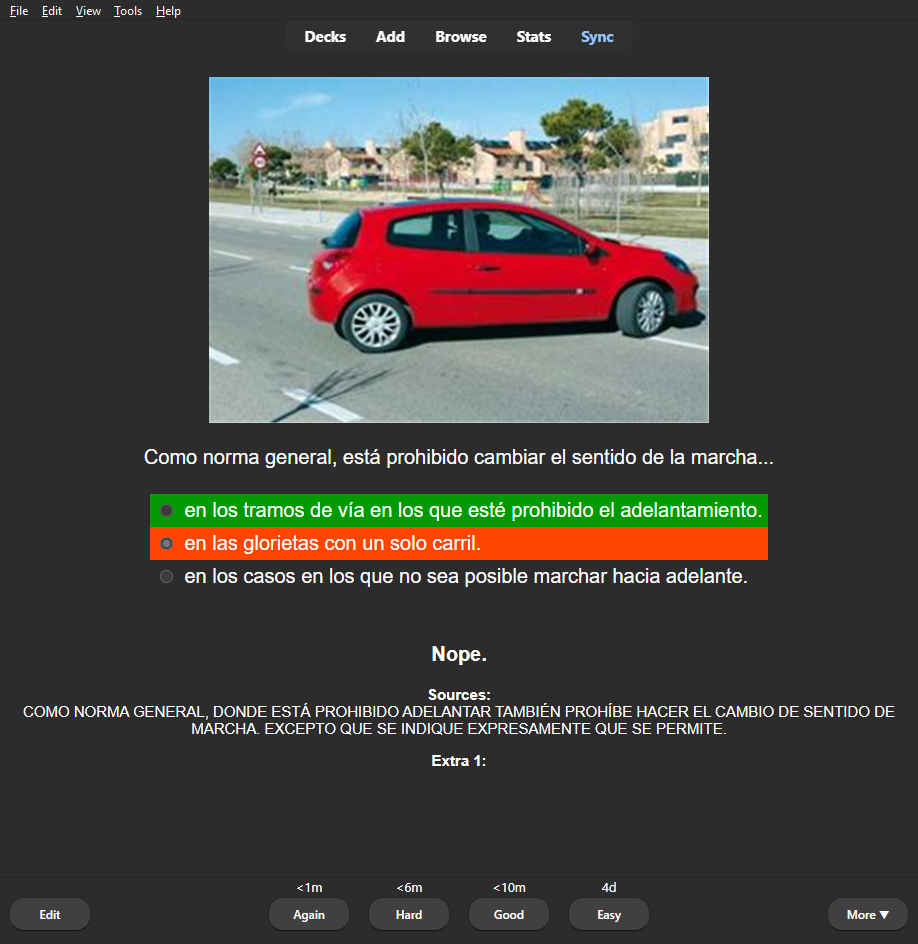

  

    
  

# [Carnet B.apkg](https://github.com/donmerendolo/anki-carnet-B/raw/master/Carnet%20B.apkg)
Un deck de anki con 2730 preguntas para el examen teórico del permiso B en España. 

## Descargar Anki
https://apps.ankiweb.net/
