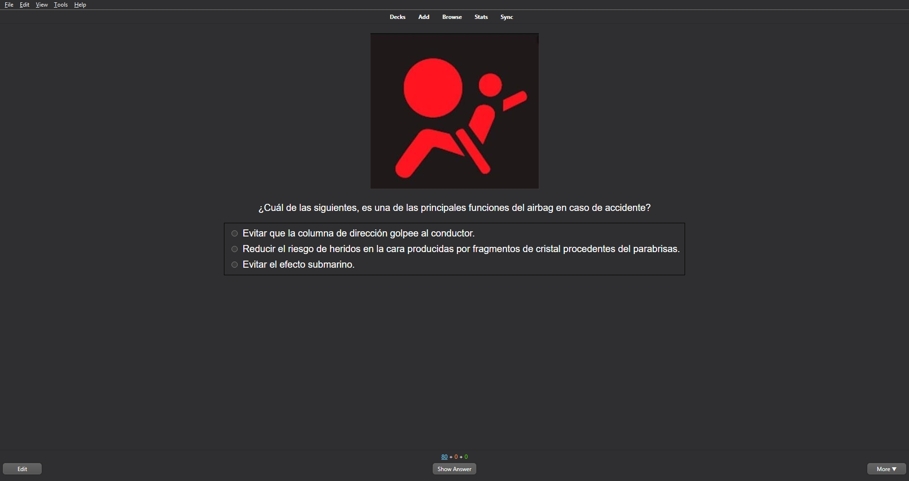
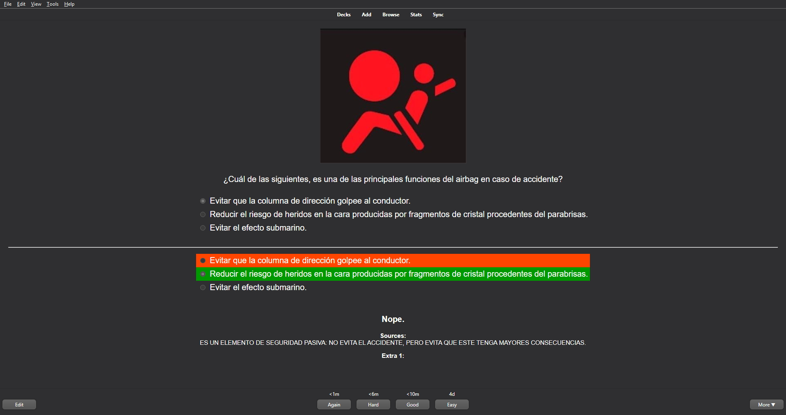

# anki-carnet-B
Un deck de anki con 2730 preguntas para el examen teórico del permiso B.

## Addon necesario
Para usar el deck hay que instalar el addon [Multiple Choice for Anki](https://ankiweb.net/shared/info/1566095810) de código 1566095810.

## Errores

 - La forma de pasar los campos de data.json a Anki es una chapuza.
 - Hay alguna que otra pregunta repetida.
 - Hay alguna errata.